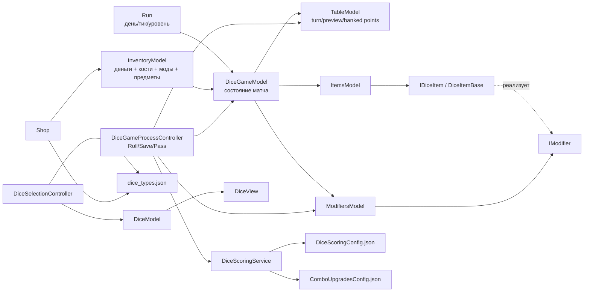
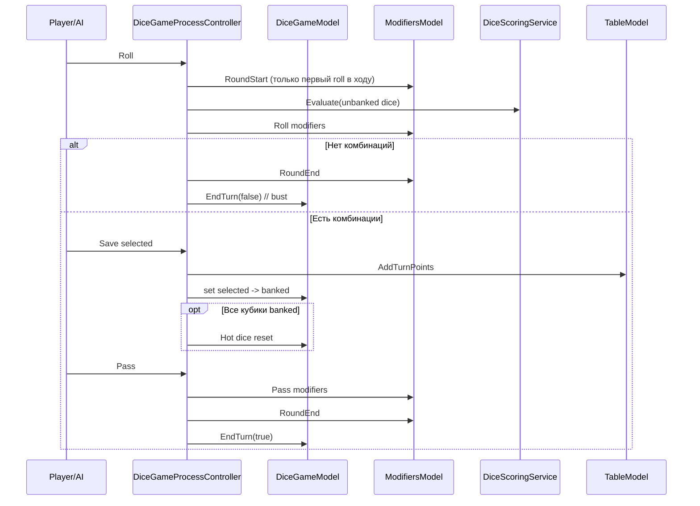

# Схема доменной модели игры в кости

## 1) Карта связей (высокий уровень)

## 2) Сущности и состав

| Сущность | Из чего состоит | Что изменяет | С кем связана |
|---|---|---|---|
| `Run` | `Day`, `Tick`, `Level`, `TicksPerDay`, `StraightState` | Прогрессию дня/уровня/тиков | `RunController`, `LevelStartModifierController`, модификаторы на день |
| `InventoryModel` | `cash`, `DiceIdList`, `ModifiersModel`, `ItemsModel` | Деньги и коллекцию костей | `Shop`, `DiceSelectionController`, `DiceGameModel` |
| `DiceGameModel` | `TableModel`, списки костей игрока/врага, `ModifiersModel`, `ItemsModel`, `TargetPoints`, ход | Состояние матча, смену хода, конец хода | Почти все контроллеры DiceGame |
| `TableModel` | `TurnPoints`, `PreviewPoints`, `PlayerBankedPoints`, `EnemyBankedPoints`, занятость слотов | Очки и доступность позиций кубиков | `DiceGameProcessController`, `DiceController`, `DiceGameViewController` |
| `DiceModel` | `CurrentValue`, `Weights`, `ConfigId`, `IsChosen`, `IsSaved` | Значение и состояние конкретной кости | `DiceView`, `DiceController`, scoring |
| `DiceScoringService` | Набор правил, override-данные, runtime state апгрейдов | Расчёт комбинаций/очков, апгрейд-стейт комбинаций | `DiceGameUtils`, `DiceGameProcessController` |
| `ModifiersModel` | Списки модификаторов по стадиям (`LevelStart/RoundStart/Roll/Pass/RoundEnd`) | Вызывает эффекты модов по lifecycle | `DiceGameProcessController`, `LevelStartModifierController`, `ItemsModel` |
| `ItemsModel` | Коллекция `IDiceItem`, биндинг к `DiceGameModel` | Добавляет предметы в pipeline модификаторов | `ModifiersModel`, `DiceGameGlobalController` |
| `IDiceItem` / `DiceItemBase` | `Id`, `State`, `ActivationType`, view-binder | Активные/пассивные предметные эффекты | `ItemsModel`, `DiceItemView`, `DiceItemController` |
| `Shop` | Слоты товаров, `restock_price`, ссылки на `DiceConfig` | Покупка/ресток, добавление костей в инвентарь | `InventoryModel`, `shop.json`, `dice_types.json` |

## 3) Событийная схема хода

## 4) Где лежат данные (config -> runtime)

| Конфиг | Что задаёт | Кто читает |
|---|---|---|
| `Assets/Resources/DiceScoringConfig.json` | Базовые правила комбинаций и base-score | `DiceScoringService` |
| `Assets/Resources/ComboUpgradesConfig.json` | Шансы/исходы апгрейдов `straight`/`ofakind` | `DiceScoringService`, `DiceGameProcessController` |
| `Assets/Resources/Json/dice_types.json` | Типы костей (`id`, `weights`, `rarity`, `price`) | `DiceSelectionController`, `Shop`, tooltip/notifications |
| `Assets/Resources/Json/dice_game_rules.json` | `target_score`, `min_bet_size` | `DiceGameGlobalController` |
| `Assets/Resources/Json/player.json` | Стартовые деньги и 6 стартовых костей | `RunController` |
| `Assets/Resources/Json/shop.json` | Ассортимент и цена рестока магазинов | `ShopFactory` / `Shop` |

## 5) Текущий набор предметов/модов по умолчанию

| Тип | Активен по умолчанию | Эффект |
|---|---|---|
| Модификатор | `MultiplyComboModifier(ThreeOfAKind)` | Увеличивает `Multiplier` у `ThreeOfAKind` на `Pass` |
| Модификатор | `ShakeRerollModifier` | На `Roll` может перебросить случайный несохранённый куб |
| Модификатор | `AdjustTicksPerDayModifier(+1)` | На `LevelStart` меняет `TicksPerDay` |
| Модификатор | `PassActivationMultiplierModifier` | Активируемый UI-оверлей, x1.5 на следующий `Pass` |
| Предмет | `ModifierSilencerItem` | Временно “глушит” pipeline модификаторов до `RoundEnd` |
| Предмет | `ExtraDiceCapItem(+4)` | Увеличивает лимит выбираемых/игровых костей (`MaxDiceCount`) |

